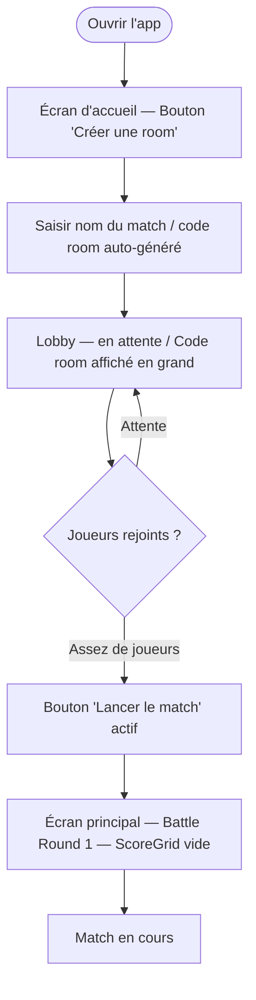
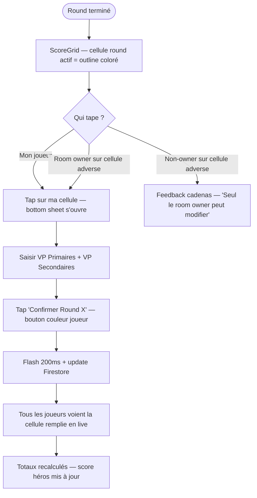
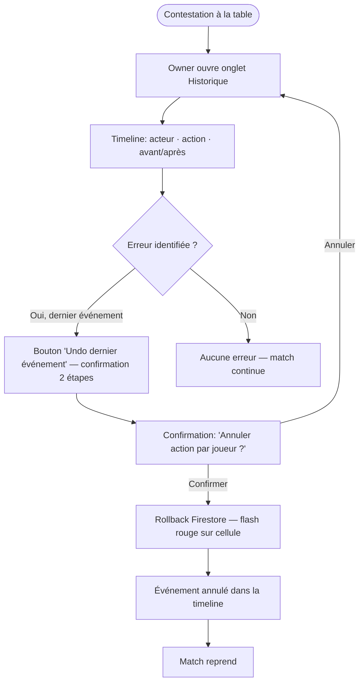
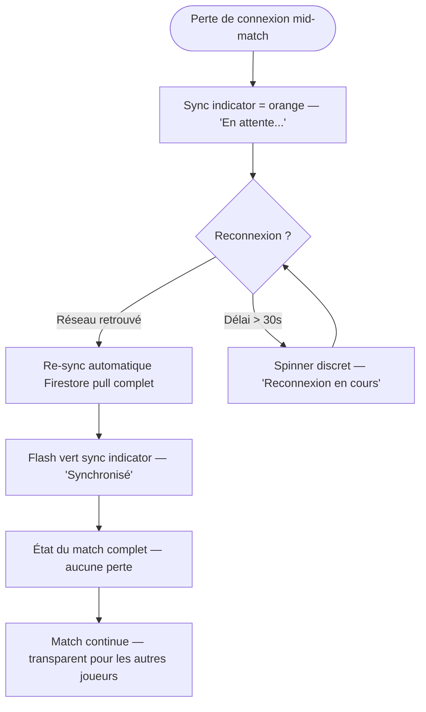

---
stepsCompleted:
  - 1
  - 2
  - 3
  - 4
  - 5
  - 6
  - 7
  - 8
  - 9
  - 10
  - 11
  - 12
  - 13
  - 14
lastStep: 14
status: complete
inputDocuments:
  - _bmad-output/planning-artifacts/prd.md
  - _bmad-output/planning-artifacts/architecture.md
workflowType: ux-design
projectName: cursor_project
author: Vartus
date: '2026-03-24'
---

# UX Design Specification cursor_project

**Author:** Vartus
**Date:** 2026-03-24

---

<!-- UX design content will be appended sequentially through collaborative workflow steps -->

## Executive Summary

### Project Vision

Warhammer Match Companion est une app Android de suivi de match Warhammer 40K en temps réel, conçue pour un usage *pendant* la partie. L'objectif UX central est de **préserver le flow de jeu** tout en garantissant une source de vérité partagée entre tous les joueurs à la table. Le produit ne résout pas un problème de stockage de scores — il résout un problème de **confiance et de rythme** au sein du groupe de jeu.

### Target Users

**Room Owner (joueur hôte)** — Crée la room, gère le match, arbitre les disputes. Utilisateur principal, le plus investi. A besoin de contrôle rapide et de visibilité totale sur l'état du match.

**Participants (joueurs invités)** — Rejoignent une room existante, mettent à jour leur propre état, consultent l'état partagé. Ont besoin d'un onboarding rapide et d'interactions à faible friction.

**Observateurs potentiels (local game store)** — Usage futur : accès read-only pour contexte de tournoi ou suivi externe.

**Profil commun :** Joueurs de jeux de plateau, niveau technique intermédiaire, pas nécessairement power users mobiles. La rapidité d'apprentissage et la lisibilité physique (mains occupées, table encombrée) sont critiques.

### Key Design Challenges

1. **Vitesse vs précision** — Actions ultra-rapides (< 30s) mais confirmation en 2 étapes pour les mutations sensibles. L'équilibre entre rapidité et protection contre les mis-taps est le défi UX n°1.
2. **Confiance partagée en temps réel** — La synchronisation doit être *perçue* comme instantanée. Le design doit renforcer visuellement cet état partagé.
3. **Gestion des conflits inline** — L'historique d'événements et l'undo doivent être accessibles sans interrompre le rythme de jeu.
4. **Onboarding à grande vitesse** — < 5 min première session, < 1 min pour les récurrents. Le flow création/jointure de room est critique.
5. **Usage en contexte physique** — Mains occupées, table encombrée, luminosité variable. Zones de tap généreuses, lisibilité à distance impérative.

### Design Opportunities

- **L'esthétique Warhammer 40K** comme avantage concurrentiel direct — l'app peut *sentir* comme un outil officiel de l'univers, renforçant l'immersion et l'adoption.
- **L'historique comme feature visible** — Transformer l'audit trail en élément de confiance affiché, pas en fonctionnalité technique cachée.
- **Architecture voice-ready** — Concevoir l'UX dès le MVP pour que l'intégration future des commandes vocales soit naturelle et cohérente.

## Core User Experience

### Defining Experience

L'interaction centrale de Warhammer Match Companion est le **tableau de score en 5 rounds** — une grille côte à côte montrant les VP Primaires et VP Secondaires de chaque joueur, par round et en total cumulé. C'est l'artefact de vérité partagée autour duquel toute la session de jeu gravite.

La saisie des scores se fait **à la fin de chaque round** — un moment distinct, délibéré, où les joueurs font le bilan ensemble. Ce n'est pas un compteur live incrémental : c'est une **déclaration de round**, avec tout le poids symbolique que ça implique.

### Platform Strategy

- **Android-first**, interface tactile, usage en contexte physique (table encombrée, dés, figurines)
- Pouce actif sur grand écran, souvent tenu d'une main pendant que l'autre est occupée
- Lisibilité à distance impérative — le téléphone peut être posé à plat sur la table, consulté par plusieurs personnes
- Pas de mode offline prioritaire au MVP, mais reconnexion transparente obligatoire
- Pas de labellisation des secondaires par round pour le MVP — juste des valeurs numériques

### Effortless Interactions

- **Saisie de fin de round** : ouvrir le tableau → taper dans la cellule du round actuel → valider. Trois gestes max.
- **Consultation de l'état** : l'écran principal affiche le score total des deux joueurs, lisible à 50cm, sans aucune interaction requise
- **Compteurs de ressources (CP etc.)** : toujours visibles, incrémentables en un tap depuis l'écran principal, jamais cachés derrière un menu
- **Reconnexion** : transparente, automatique, sans action utilisateur — l'état se re-sync en arrière-plan

### Critical Success Moments

1. **Premier round complété** — les deux joueurs saisissent leurs scores, voient le tableau se remplir côte à côte, en temps réel. C'est le moment "ça marche, c'est magique".
2. **Consultation en coup d'œil** — à n'importe quel moment du match, n'importe quel joueur peut voir d'un regard l'état complet du match sans toucher à son téléphone.
3. **Résolution de dispute** — un player conteste un score ; on ouvre l'historique, on voit qui a saisi quoi, on undo si nécessaire. L'app arbitre sans créer de tension.

### Experience Principles

1. **Le tableau est la vérité** — toute décision de design sert la lisibilité et la confiance dans ce tableau
2. **La saisie est un rituel** — se fait en fin de round, consciemment, pas en flux continu
3. **Tout visible, rien caché** — scores des deux joueurs côte à côte, CP toujours en vue, pas de navigation pour l'essentiel
4. **La synchronisation se sent** — feedback visuel immédiat quand l'état change chez un autre joueur
5. **L'erreur est récupérable** — undo visible et accessible rassure, même s'il est rarement utilisé

## Desired Emotional Response

### Target Emotions

| Émotion | Déclencheur UX | Priorité |
|---|---|---|
| **Confiance** | Synchronisation visible, cohérence affichée en permanence — "ce score est vrai" | Critique |
| **Contrôle** | Undo accessible, historique lisible, ownership clair sur ses propres données | Critique |
| **Immersion** | Esthétique et terminologie ancrées dans l'univers W40K — l'app *appartient* à la table | Haute |
| **Fluidité** | Interactions rapides, aucune friction cognitive, l'app ne coupe pas le flow de jeu | Critique |
| **Fierté** | Un tableau final propre et clair — un résultat digne d'être montré | Moyenne |

### Emotions to Avoid

- ❌ **Anxiété** — "Est-ce que le score est bien synchronisé ?" → indicateurs de sync permanents, feedback d'état réseau
- ❌ **Frustration** — "J'ai tapé au mauvais endroit" → zones de tap généreuses, confirmation pour les actions destructives
- ❌ **Méfiance** — "Quelqu'un a-t-il modifié mon score ?" → historique avec attribution par joueur obligatoire
- ❌ **Distraction** — "Je passe plus de temps sur l'app que sur ma partie" → interactions minimales, aucune notification parasite

### Tone & Aesthetic Direction

**Sobre avec des touches thématiques W40K** — l'esthétique Warhammer est présente et immersive (dark, metal, grimdark), mais ne compromet jamais la lisibilité ou la rapidité. L'app reste un outil de match avant d'être un objet de collection.

**Neutre sur la tension compétitive** — pas d'animations dramatiques quand un joueur prend la tête. L'app reste factuelle et impartiale. La tension vient du match, pas de l'interface. Le design renforce la confiance mutuelle, pas la rivalité.

## UX Pattern Analysis & Inspiration

### Design Direction: "Épuré / Élégant / Futuriste"

Pas grimdark — **sci-fi premium**. L'app doit ressembler à un terminal de commandement de précision qui appartient à l'univers 40K sans le crier.

### Inspiring References

| Référence | Ce qu'on retient | Ce qu'on rejette |
|---|---|---|
| **Apple Watch Workout / Whoop** | Chiffres dominants, espaces négatifs généreux, typo numérique ultra-lisible, hiérarchie parfaite | Rien à rejeter — modèle de lisibilité mobile |
| **F1 Live Timing App** | Tableau temps réel sobre, noir dominant, accents colorés par joueur, flash subtil sur changement de valeur | Densité trop poussée pour un usage en match |
| **Cyberpunk 2077 / Deus Ex Mankind Divided HUD** | Futurisme sobre : lignes géométriques fines, transparences, typographie condensée, effets discrets | Effets glitch trop présents, lisibilité à sacrifier |
| **Linear / Vercel Dashboard (dark mode)** | Design épuré sur fond gris profond, accents haute saturation, micro-animations 200ms max | Complexité pour experts, pas pour usage mobile rapide |
| **Warhammer 40K : Mechanicus (jeu vidéo)** | Terminal de précision futuriste, lignes fines, couleurs électriques sur noir — la référence exacte | N/A — c'est le modèle d'inspiration principal |

### Key UX Patterns to Adopt

| Pattern | Source | Application |
|---|---|---|
| **Fond sombre profond** | Mechanicus, Deus Ex | `#0D0F14` ou similaire — quasi-noir, pas noir pur |
| **Typographie numérique condensée** | F1 App, Apple Watch | Monospace/tabular nums, scores en très grande taille |
| **Accents colorés par joueur** | F1 Timing, Linear | 2 couleurs vives distinctes sur fond sombre (ex: bleu électrique vs rouge sang) |
| **Lignes fines géométriques** | Cyberpunk HUD, Mechanicus | Séparateurs 1px, coins légèrement coupés (bevel), grille structurée |
| **Micro-animations discrètes** | Linear, Vercel | Flash subtil sur changement de valeur, transitions 200ms max |
| **Espaces négatifs généreux** | Apple, Whoop | Chaque zone respire — rien d'entassé |

## Design System Choice

### Decision: Material Design 3 + Custom Match Components

**Fondation :** Material Design 3 (Flutter natif) avec dark theme fortement customisé.

**Rationale :**
- Android-first avec Flutter : Material 3 est le choix natif zero-friction
- Le theming MD3 (ColorScheme, TextTheme, ShapeTheme) permet une customisation complète de l'identité visuelle futuriste
- Touch targets (48dp minimum), accessibilité, navigation — tout est géré par la fondation
- L'aspect "Material" sera totalement effacé par le theming agressif (dark quasi-noir, accents custom, typographie monospace)

### Custom Components (built on Flutter primitives)

Ces widgets seront entièrement conçus pour W40K Companion, sans ressemblance Material :

| Composant custom | Usage | Description |
|---|---|---|
| `ScoreGridWidget` | Écran principal | Tableau 5 rounds × 2 types VP, 2 joueurs côte à côte |
| `RoundScoreCell` | Dans ScoreGrid | Cellule éditable par round — tap pour ouvrir saisie |
| `ResourceCounter` | Bandeau principal | Compteur CP avec +/- touch, feedback haptique |
| `SyncStatusIndicator` | Global | Icône de sync Firestore — vert/orange/rouge |
| `PlayerPresenceBadge` | Header | Avatar coloré par joueur, indicateur de présence live |
| `EventTimelineItem` | Historique | Item d'audit trail avec actor/action/before/after |

### Theme Tokens

- **ColorScheme :** dark seed custom — fond `#0D0F14`, surface `#161920`
- **Accents joueurs :** 2 couleurs haute saturation assignées à la création de room
- **Typography :** `TextTheme` avec override monospace/condensé pour les chiffres
- **Shape :** léger bevel (corners `4dp` coupés) sur les cards et containers
- **Brightness :** dark uniquement, pas de light mode pour le MVP

## Defining Core Interaction

### The Defining Interaction: Round Score Declaration

L'interaction qui, si elle est parfaite, fait tout le reste suivre : **la saisie du score de fin de round**.

C'est un acte délibéré — le joueur "déclare" son round à la table. Visible par tous, synchronisé instantanément, ancré dans l'historique.

### Interaction Flow

1. **Trigger** — Round terminé. Le joueur tape sa cellule du round actuel dans le ScoreGrid (ou le room owner tape la cellule de n'importe quel joueur)
2. **Bottom sheet** — S'ouvre avec deux champs : VP Primaires / VP Secondaires du round en cours. Clavier numérique natif, champs larges
3. **Confirmation** — Bouton "Confirmer Round X" — grand, couleur d'accent du joueur, tap unique (pas de double confirmation — saisie, pas action destructive)
4. **Broadcast** — Firestore update → tous les joueurs voient la cellule se remplir avec micro-flash de la couleur du joueur
5. **Totaux** — Colonne totale + grand score cumulé se mettent à jour instantanément pour tous

### Ownership & Permission Model

- **Chaque joueur** contrôle sa propre ligne de score (saisie et modification)
- **Le room owner** a override total — peut modifier n'importe quelle valeur, undo n'importe quel événement, gérer les rounds
- Les cellules d'un autre joueur affichent un cadenas discret pour les non-owners ; tap = feedback clair sans action

### Key Micro-Details

- La cellule du **round actif** est visuellement distincte — les rounds passés sont figés, les futurs sont grisés
- Après confirmation : la cellule affiche VP Prim + VP Sec en deux lignes, total en bas — lisible en un coup d'œil
- **Animation 200ms** : opacity flash de la couleur du joueur sur les cellules mises à jour — signale le changement sans dramatiser
- **Feedback haptique** sur confirmation — léger impact tap, confirmation physique de l'action

## Visual Foundation

### Color Palette

**Fonds & surfaces :**

| Token | Valeur | Usage |
|---|---|---|
| `surface-bg` | `#0D0F14` | Fond d'écran principal |
| `surface-card` | `#161920` | Cards, ScoreGrid, containers |
| `surface-elevated` | `#1E2330` | Bottom sheets, modals |
| `border-subtle` | `#2A2F3E` | Séparateurs, lignes de grille |

**Accents joueurs (assignés à la création de room) :**

| Slot | Couleur | Nom |
|---|---|---|
| Joueur 1 | `#4FC3F7` | Imperial Blue |
| Joueur 2 | `#EF5350` | Crimson |
| Joueur 3+ | `#66BB6A` / `#FFA726` | Extensible post-MVP |

**Feedback système :**

| Token | Valeur | Usage |
|---|---|---|
| `sync-ok` | `#4CAF50` | Indicateur sync vert |
| `sync-pending` | `#FF9800` | En attente / reconnexion |
| `sync-error` | `#F44336` | Déconnecté |
| `text-primary` | `#E8EAF0` | Texte principal |
| `text-muted` | `#5C6478` | Labels secondaires, rounds futurs |

### Typography

| Usage | Font | Taille | Style |
|---|---|---|---|
| **Grand score total** | `Roboto Mono` | `56sp` | Bold, couleur joueur |
| **Scores de cellule** | `Roboto Mono` | `20sp` / `14sp` | Medium / Regular |
| **Labels de section** | `Roboto Condensed` | `11sp` | Uppercase, letter-spacing +1.5 |
| **Corps / actions** | `Roboto` | `14sp–16sp` | Regular |
| **Bouton principal** | `Roboto Condensed` | `14sp` | Bold, uppercase |

### Spacing & Shape

- **Grid base :** 4dp — tous les espacements sont multiples de 4
- **Touch targets :** 48dp minimum (Material 3)
- **Border radius :** 4dp — effet bevel léger, pas de coins très arrondis
- **Séparateurs :** 1px, `border-subtle`
- **Dark mode only :** pas de light mode pour le MVP

## Design Direction Mockups

### Selected Direction: Futuristic Command Terminal

Direction validée : **épuré, élégant, futuriste** — un terminal de commandement de précision ancré dans l'univers 40K sans être criard.

### Screen Architecture

**Écran principal — Match en cours :**
- **Zone héros** (haut) : grands scores totaux côte à côte en `Roboto Mono 56sp`, couleur par joueur
- **ScoreGrid** (centre) : tableau 2 joueurs × 5 rounds × 2 types VP, états visuels distincts par round
- **CP Strip** (bas) : compteurs Command Points toujours visibles, +/− larges
- **Bottom Nav** : 4 onglets — Match / Historique / Joueurs / Room

**Bottom Sheet — saisie de round :**
- S'ouvre sur tap de la cellule round actif
- Deux champs larges VP Prim / VP Sec, valeurs en `28sp` couleur joueur
- Un seul bouton de confirmation pleine largeur, couleur joueur

### Mockup File

Visualisation interactive : `_bmad-output/planning-artifacts/ux-mockup-match-screen.html`

### Key Visual Decisions

| Décision | Valeur retenue | Raison |
|---|---|---|
| Fond principal | `#0D0F14` | Quasi-noir, pas noir pur — profondeur sans agressivité |
| Score total | `Roboto Mono 56sp Bold` | Lisibilité à distance, caractère numérique/terminal |
| Couleurs joueurs | `#4FC3F7` / `#EF5350` | Contraste maximal sur fond sombre, distinction immédiate |
| Border radius | `4dp` | Bevel léger — futuriste, pas arrondi |
| Animations | `200ms opacity flash` | Signale le changement sans dramatiser |
| Sync indicator | Point pulsé en status bar | Toujours visible, jamais intrusif |

## User Journey Flows

### Journey 1 — Créer & démarrer une room (Owner, chemin heureux)



### Journey 2 — Saisie de score fin de round



### Journey 3 — Dispute & résolution via undo (Owner)



### Journey 4 — Reconnexion mid-match



### Journey Patterns Identified

- **Ownership gate** : toute action modifiant les données d'un autre joueur est bloquée visuellement pour les non-owners, avec feedback explicite
- **Broadcast feedback** : toute mutation Firestore se traduit par un flash visuel sur tous les clients simultanément
- **Récupération sans perte** : disconnect/reconnect est transparent — aucune action utilisateur requise
- **Confirmation 2 étapes** réservée aux actions destructives (undo) uniquement — les saisies courantes sont tap unique

## Component Strategy

### Material 3 Components (themed, not rebuilt)

| Composant Material | Usage | Customisation |
|---|---|---|
| `NavigationBar` | Bottom nav 4 onglets | Background `surface-card`, items thémés |
| `ModalBottomSheet` | Saisie score de round | Border radius top `20dp`, fond `surface-elevated` |
| `FilledButton` | 'Confirmer Round X' | Couleur joueur dynamique, shape `4dp` |
| `SnackBar` | Feedback undo confirmé | Dark themed, durée courte |
| `TextFormField` | Champs VP dans bottom sheet | Style monospace, clavier numérique |

### Custom Widgets (W40K Companion specific)

| Widget | Description | Inputs clés |
|---|---|---|
| `ScoreHeroBar` | Zone haute — 2 grands scores côte à côte | `player1Score`, `player2Score`, couleurs |
| `ScoreGridWidget` | Tableau 5 rounds × 2 joueurs | `rounds`, `activeRound`, `currentUserId`, `isOwner` |
| `RoundScoreCell` | Cellule individuelle du ScoreGrid | `state: empty/active/filled/locked/future`, VP, couleur |
| `ResourceCounter` | Compteur CP avec +/− | `label`, `value`, `playerColor`, `canEdit`, callbacks |
| `SyncStatusIndicator` | Point pulsé état sync | `status: synced/pending/offline` |
| `PlayerPresenceBadge` | Avatar couleur + online/offline | `playerName`, `playerColor`, `isOnline`, `isOwner` |
| `EventTimelineItem` | Item historique actor/action/before/after | `actor`, `actionType`, `before`, `after`, `timestamp` |
| `OwnershipLockFeedback` | Feedback tap sur cellule verrouillée | `onTap` |

### Screen Hierarchy

```
AppShell
├── LobbyScreen           ← création / jointure de room
├── MatchScreen           ← écran principal
│   ├── ScoreHeroBar
│   ├── ScoreGridWidget
│   ├── ResourceCounter (CP strip)
│   └── RoundScoreSheet   ← bottom sheet saisie
├── HistoryScreen         ← EventTimelineItem list + undo
└── RoomScreen            ← joueurs connectés + gestion (owner only)
```

## UX Consistency Patterns

### Buttons & Actions

| Situation | Pattern | Exemple |
|---|---|---|
| **Action principale** | `FilledButton` pleine largeur, couleur joueur concerné | "Confirmer Round 3" |
| **Action destructive** | `OutlinedButton` + confirmation 2 étapes obligatoire | "Undo dernier événement" |
| **Action secondaire** | `TextButton` ou icon button | "Partager le code room" |
| **Action désactivée** | Opacity `0.38`, non-tappable | Bouton "Lancer" avant 2 joueurs |

### Forms & Input

| Situation | Pattern |
|---|---|
| **Saisie numérique** | Clavier numérique natif systématique (`keyboardType: numeric`) |
| **Validation** | Inline uniquement si valeur invalide — pas de validation préventive |
| **Champs larges** | Min `height: 56dp`, padding `12dp` — optimisés pour tap imprécis |
| **Valeur vide** | Placeholder `—` en `text-muted`, jamais de 0 par défaut |

### Navigation & Feedback

| Situation | Pattern |
|---|---|
| **Retour** | Swipe down sur bottom sheets, flèche back sur écrans secondaires |
| **Action réussie** | Flash couleur 200ms sur l'élément modifié — pas de SnackBar pour les actions courantes |
| **SnackBar** | Réservé aux confirmations d'actions destructives (undo appliqué) |
| **Loading** | Skeleton shimmer — jamais de spinner bloquant |
| **Erreurs réseau** | Inline dans le sync indicator — pas de dialog bloquant |

### Ownership & Permissions

| Situation | Pattern |
|---|---|
| **Élément verrouillé** | Icône cadenas `12px` coin sup. droit, opacity `0.3` |
| **Tap sur verrouillé** | Micro-vibration + message inline discret |
| **Actions owner-only** | Badge "OWNER" discret sur les contrôles exclusifs |
| **Undo** | Toujours 2 étapes + description de l'action à annuler |

### Sync State Patterns

| État | Indicateur | Comportement UI |
|---|---|---|
| **Synced** | Point vert pulsé | Normal |
| **Pending** | Point orange | UI interactive, actions en queue |
| **Offline** | Point rouge + bannière | Lecture seule, actions bloquées |
| **Reconnecting** | Point orange animé | Spinner, pas d'action destructive permise |

## Responsive Design & Accessibility

### Responsive Strategy

**Android-first, portrait uniquement pour le MVP. Pas de breakpoints complexes.**

| Cible | Approche |
|---|---|
| **Téléphones standard** (360–420dp) | Layout principal — ScoreGrid pleine largeur, CP strip en bas |
| **Grands téléphones** (420–480dp) | Score héros plus grands, cellules plus généreuses — `LayoutBuilder` adaptatif |
| **Tablettes** | Non supportées pour le MVP |
| **Orientation paysage** | Non prioritaire pour le MVP — conçu portrait |

**Contrainte clé :** le ScoreGrid (5 rounds + total) doit rester entièrement visible sans scroll horizontal sur tout écran ≥ 360dp.

### Touch & Physical Ergonomics

| Règle | Valeur | Raison |
|---|---|---|
| **Touch target minimum** | `48×48dp` | Tap précis impossible en match actif |
| **CP buttons** | `40dp wide × 48dp tall` | Zone ample pour tap rapide |
| **Cellules ScoreGrid** | `min 52dp tall` | Lisibilité + tap sans zoom |
| **Spacing entre tappables** | `≥ 8dp` | Évite les taps accidentels adjacents |

### Accessibility

| Aspect | Implémentation Flutter |
|---|---|
| **Contraste** | Ratio min `4.5:1` — `#4FC3F7` sur `#0D0F14` = 8.1:1 ✅ |
| **Semantics** | `Semantics` widget sur cellules ScoreGrid — label descriptif complet |
| **Screen reader** | `ExcludeSemantics` sur éléments décoratifs uniquement |
| **Taille de texte** | Respecter `textScaleFactor` système — pas de tailles px hardcodées |
| **Feedback haptique** | `HapticFeedback.lightImpact()` sur confirmations |
| **Couleur seule** | Jamais comme seul indicateur — sync indicator a texte + couleur |

### Dark Mode

Dark mode uniquement pour le MVP. Thème sombre = thème par défaut et unique.
